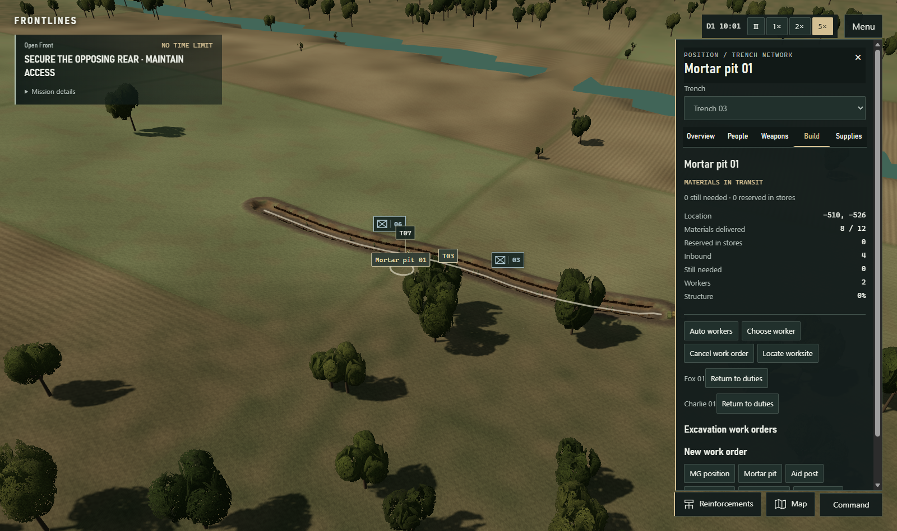
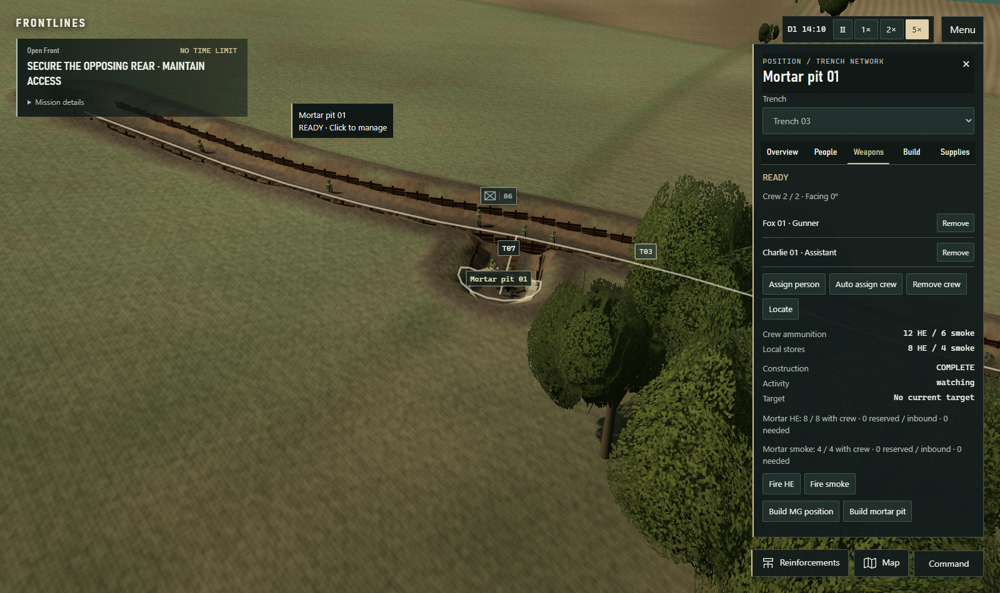
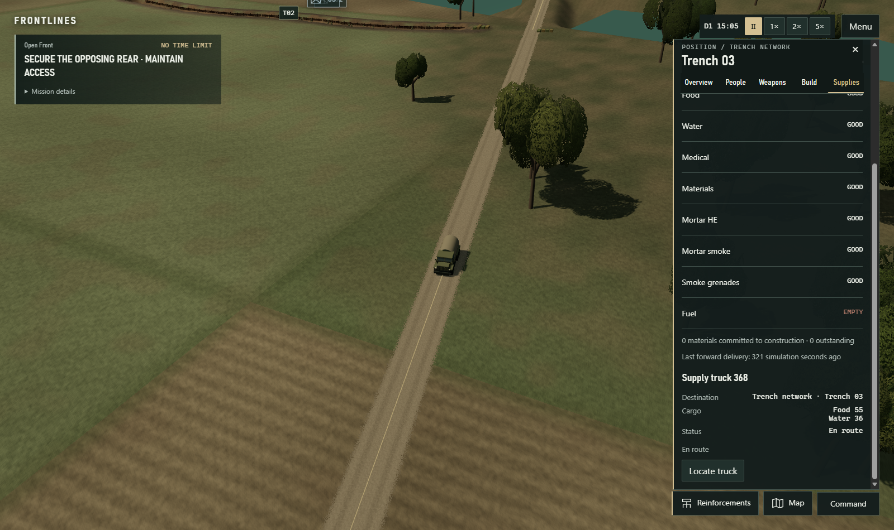

# V1 architecture addendum

## Authority map (before implementation)

Starting revision: `8b226d070cd22940b9b893ba6f3fd728d83b647b`, clean master.

| Concern | Existing authority | Decision for this pass |
| --- | --- | --- |
| Formation | Squad orders and soldier squad ID | Retain; individual position assignments must not change other members' orders. |
| Person | Soldier needs, carried equipment, duty and personal network membership | Retain. Search local friendly people first, not the operator's formation. |
| Network | Garrison anchor trench plus traversable trench component | Retain internally; present as trench network. |
| Weapon | Facility geometry and `weaponCrewIds`; obsolete squad metadata migrates away | Person IDs remain sole crew authority. Mortar requests and missions additionally identify the actual position, never re-resolve it through the operator's squad. |
| Work | Main trenches use engineer queues; support facilities use work orders | Keep both simulation systems, expose one common work-order readout. Add explicit cancellation state without deleting delivered stock or excavated earth. |
| Materials | Physical rear/local/forward/facility stocks, truck cargo, personal packs, crates | Retain these inventories and conservation ledger. Claims never create, remove or copy stock. |
| Reservations | Previously only same-job carrier subtraction and stock targets | Add a bounded, serialized demand ledger. Each demand identifies network, consumer, resource, target and disjoint claims on physical local/forward/truck/carrier sources. Reconcile deterministically as goods move, consumption occurs or work is cancelled. |
| Shipment | Physical truck assignment and carrier duty | Retain. Demand drives loading priority; actual assigned network and cargo drive the readout. |
| UI | Position inspector plus overlapping Defense / Build facilities controls | Position becomes the manager; Build is placement only, Support opens actual positions, Defense becomes an emergency/redirect surface. |

## Minimum new model

`LivingWorld.supplyDemands` is accounting only: a stable consumer/resource key, target, usable/delivered amount, priority and source claims. Construction requirements still come from the work order's facility cost. Weapon reserves are per physical position; personnel necessities and normal network reserves are lower-priority consumers. Each physical source/resource balance is allocated once, in priority then creation/ID order. Dedicated job carriers retain their own destination claims. Rear stock is not promised until loaded onto an assigned truck.

Refresh at command boundaries and logistics/coordinator updates. Transfers consult the ledger, and reconciliation follows physical movement. Same-rules saves preserve the ledger exactly; old saves initialize it deterministically without adding resources. Cancellation releases future claims; site stock and already incorporated materials stay at the site. Cancelled carriers return cargo physically through the existing delivery path.

Mortar mission `positionId` is authoritative for readiness, operator, ammunition and launch checks. `squadId` remains provenance/formation identity and grenade compatibility, not mortar ownership. Legacy missions resolve once from their named crew when unambiguous; otherwise cancel only unlaunched work with a visible explanation.

Player automatic facility planning is disabled at both planner and request boundaries. Prepared scenario structures and explicit player orders remain allowed; enemy planning remains bounded by existing rules.

## Verification plan

- Mixed-formation crew, unchanged formation orders, save/load identities.
- Two pits with operators from one formation: clicking either pit fires only that pit, with no squad selected.
- 16 + 12 material requirements against 20 real materials: claims 16 + 4, deficit 8; cancellation, transit and save/load conserve stock.
- No spontaneous player structures over a meaningful supplied simulation interval.
- Real Edge position workflow and screenshots; focused tests, full regressions, production build, packaging and offline checks.

## Results

The mandatory addendum is implemented on top of the existing person-level V1 foundation. No training, new automation, unrelated combat overhaul, or user-save deletion was performed. The foundations/Three.js skills kept authoritative simulation and save state separate from presentation; the UI/playtest skills required actual Edge controls and visual inspection, not only headless assertions.

### Requirement coverage

| Requirement | Implementation / evidence |
| --- | --- |
| Mixed-formation weapon crews | `weaponCrewIds` is the sole crew authority. Local connected personnel are preferred; fallback candidates are bounded to 180 m. Faction, equipment, life state, route, task and capacity checks still apply. Existing `weaponSquadId` survives only as input to legacy migration. |
| Position-centric mortar fire | `requestPositionSupport(positionId, …)` resolves the actual operator, crew and ammunition. Missions retain that position and those people through save/load. A squad-based compatibility request is rejected if its operators crew more than one pit. |
| Concrete demand | Construction, physical weapon ammunition, critical personal necessities and fallback reserves share deterministic allocation. Urgent combat shortages precede explicit works; works precede weapon stocks, critical necessities and reserves. No resource is transferred by accounting. |
| Reservations | The 16 + 12 / 20 regression commits 16 + 4, leaving 8 demanded. Dedicated carrier cargo stays assigned to its site; trucks are counted only against their actual destination. Returning/captured shipments cannot promise cargo forward. |
| Cancellation | Releases workers and future claims; retains the site, earthworks, delivered stock and any already-funded material budget. Surplus carried material returns physically. Cancellation does not refund consumed/incorporated materials to the rear depot. |
| One manager | Click a trench, pit or MG → Position. Overview / People / Weapons / Build / Supplies are its five pages. Build → Worksites redirects here; the old Defense → Facilities manager is removed. Only the emergency decision remains in the former Defense drawer. |
| Truck readability | Named nonzero cargo, actual network/depot/map-edge destination, status, per-job material claims and Locate. Shared loads are not described as exclusively belonging to one job. |
| Common work orders | Main trench excavation and support works expose location, status, progress, personnel, materials and blockers through Position → Build. Their simulation implementations remain separate. |
| Explicit player building | Both automatic planning and non-explicit player facility requests are blocked. Existing/prepared works remain; enemy planning is retained. A supplied 12-campaign-hour no-order regression creates no new player structures. |
| Player language | Visible default network names no longer say Garrison; manual instructions describe explicit works and Position management. Obsolete generic placement instructions are removed; MG, mortar and rear-support placement retain their distinct checks. |
| Saves | The rules identity is `combat-35-position-demand-accounting-world2`. Legacy copies initialize missing demand and resolve unambiguous mortar positions without adding stock or people. Loading validates holder ownership, claim balances and crew faction; saving refreshes derived accounting after paused commands. Original storage keys/copies remain untouched. |

### Bugs found during real play

1. **Construction delivery deadlock — fixed.** A worker rested on the shared connector entrance after delivering eight materials. The second worker, carrying the final four, yielded there for more than 150 simulation seconds. Waiting workers now stand aside; construction handoff uses a clear, continuous passage within 1.3 m, like existing physical aid handoff. The saved blocked game resumed and completed the same pit without changing its stock or moving anyone by debug command. A focused regression reproduces the occupied entrance. Blocked material carriers now also produce a specific work-order blocker.
2. **Enemy construction visibility — fixed.** An unexcavated enemy support connector had no graph component yet, so it briefly appeared in the player's construction list. Ownership is now checked through its support structure before graph membership. A regression covers the zero-progress case.
3. **Pausing between commands and Save — fixed.** A released carrier could leave a stale derived claim until the next simulation tick. Saving validates physical state and refreshes its accounting copy, preserving the person's real cargo; loading does not silently accept corrupt claims.
4. **Mixed-crew mission validation — fixed.** Save validation previously required the support mission's people to share a squad. It now requires the correct friendly side and position/person identities.

### Actual Edge playthrough

Isolated QA profile `v1-addendum-qa`, production preview at port 4175, Open Front / US / medium / seed 1944 / close staging. Player actions used normal controls. State/projection diagnostics were read-only; no inventory grants, teleports, time jumps, or debug restored-state fixtures were used in this flow. The separate automated roof/crew tests use explicitly labeled synthetic fixtures.

1. Start, manually pause, save, refresh and Continue.
2. Click Trench 01, select Trench 03, order a mortar pit next to it. Two individual workers were assigned: Fox 01 and Charlie 01. No squad was selected.
3. Observe 12 reserved materials become 8 delivered plus 4 physically inbound. Preserve the failed entrance-blockage screenshot, save the blockage, rebuild, reload that same game, and resume. Pit 384 completed with its original 12-material budget.
4. Assign the mortar gunner, replace the initially chosen Fox assistant with Charlie 01. The final crew was person IDs **303 and 276**; Charlie and Fox both retained their existing trench orders.
5. Click the actual finished pit. Inspector showed **READY**, 12 HE / 6 smoke, Fox gunner and Charlie assistant; the selected-formation docket was hidden.
6. Fire HE from the pit UI at a 100 m target area. Mission 393 recorded **position 384**, **crew [303, 276]**, and **PLAYER** authority. Save during preparation, refresh, Continue, then resume. The same mission completed; `ammoConsumed` became **1** and the gunner's HE changed **12 → 11**.
7. Inspect Supplies: truck 368 showed its actual Trench 03 assignment, **Food 55 / Water 36**, En route. Locate converged on the truck at **144.475, −284.067**, not the network entrance.
8. Build → Worksites opened Position's Build page and closed the placement catalog; no independent Defense-status button remained.
9. Explicitly order a rest dugout, let its materials arrive, then cancel through its work-order button. The site retained its 12-material funded budget, consumed ledger was unchanged by cancellation, workers were released and its demand disappeared. Save succeeded with the cancelled site retained.

The existing older `v1-position-qa` save was also opened in the revised build without replacing that save. Its previous structures, mixed crew and existing supply problems were preserved; it was not treated as a newly completed combat test.

Additional evidence: [pit fire order](evidence/v1-architecture-addendum/addendum-05-pit-fire-order.png), [cancelled work](evidence/v1-architecture-addendum/addendum-07-cancelled-work.png), [preserved blocked entrance](evidence/v1-architecture-addendum/addendum-failed-carrier-entrance.png). Screenshots were opened and visually reviewed.

### Verification

- `npx vitest run --maxWorkers=1`: **76 files / 602 tests passed**, on unchanged sources throughout the 176.33-second full regression run. Includes the 72-campaign-hour supplied conservation soak, mixed-formation MG readiness before/after save, two independently addressed pits sharing an operator formation, material claims/cancellation/transit/loss, no-player-auto-build, complex excavation and deterministic speed/save continuation. No timeout thresholds were increased.
- Final readout-only follow-up removed redundant shipment notes and corrected idle convoy status to **At map edge**. **40 focused tests passed** across supply demand, position management and trench readouts after this adjustment; the shipping build and offline checks below were rerun on that final version.
- `npx playwright test --workers=1`: **23 passed**. Includes actual pit clicks, no-squad firing, mixed-crew save/load, roof rejection, Hold recovery, emergency-drawer priority, reserve configurations and eight desktop viewport sizes.
- `npm run build`: **passed**, including TypeScript, production assets and the offline HTML. The existing >500 kB bundle warning remains.
- `npm run test:packaging`: **5 passed**.
- `node scripts/qa-file-boot.mjs FRONTLINES.html addendum-offline-shipping isolated`: **passed**. A copied HTML boots offline with two embedded workers, accepts an actual move order and retains an exact paused save. 1280 × 720 and 1920 × 1080 refresh sizing passes; zero page/console errors and no HTTP dependencies. Save hashes both `a7573f9509da391c5fd76906095452a4c5a174a6723004d685a6c70504b95747`.
- Manual Edge console: **0 errors / 0 warnings**.
- `git diff --check`: **passed**.

Local detailed logs remain in `output/playwright/addendum-*`; final offline evidence is in `addendum-offline-shipping-1790308840756/result.json` (the preceding release run is also preserved). First and second e2e failure directories were copied before reruns. Initial failures include obsolete auto-building assertions, missing initialization of new derived state, and two fixture problems (a helper left in two pits and clicking during camera settling). A dev reload interrupted an intermediate browser run. A broad parallel unit/browser run timed out in two existing long tests; serial reruns pass without relaxing limits. One intermediate run compiled the old truck readout before its new return-destination assertion was edited; the successful full run used unchanged sources throughout. These failures are retained, not relabeled as successful evidence.

### Remaining limits / acceptance

- **Blind discoverability and subjective playability are still pending.** Green tests and a developer-guided playthrough do not prove that a new player finds the system intuitive.
- Existing long foot supply legs, terrain/path congestion elsewhere, needs pacing, rendering and animations are not comprehensively redesigned here. The reproduced construction-mouth deadlock is fixed; this is not a claim that all crowding is solved.
- Cancellation preserves delivered loose stock and the existing funded-site accounting. There is no new salvage/refund mechanic for funded materials or old excess stock at non-store sites.
- No new 300/1,000-person browser performance certification, CrazyGames approval, neural training, publishing, or overnight automation was performed. The fixed-step save/speed and 72-campaign-hour conservation regressions are functional evidence, not frame-time certification.
