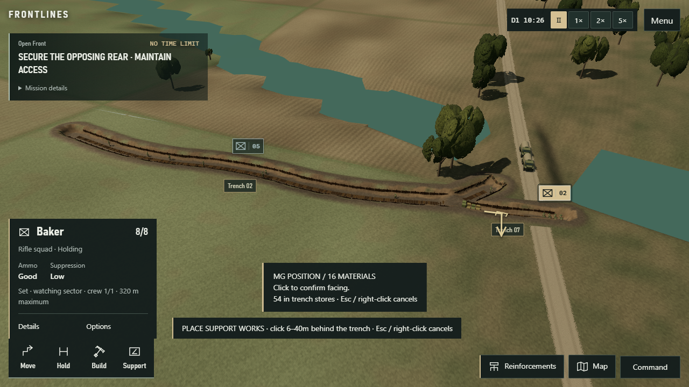
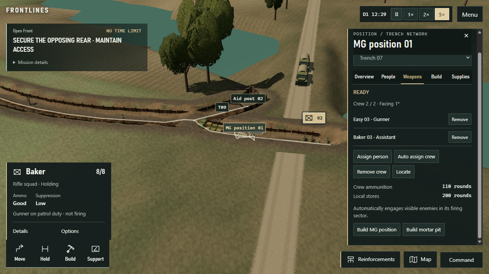
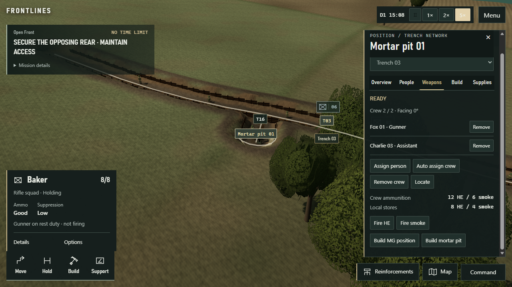
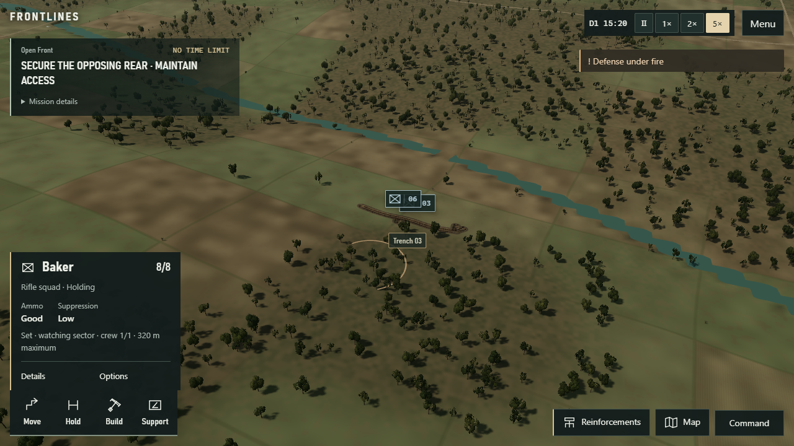
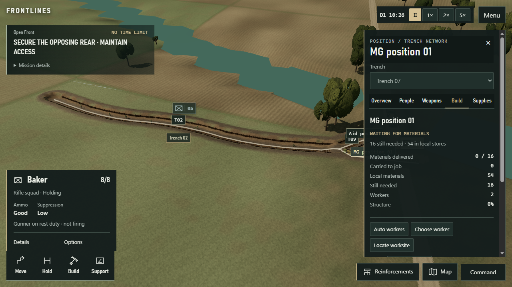
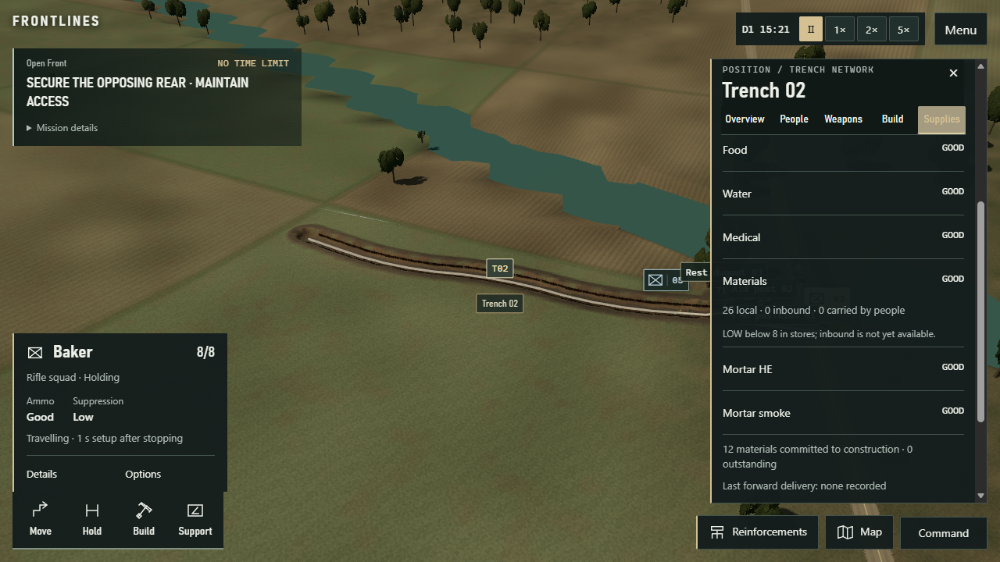
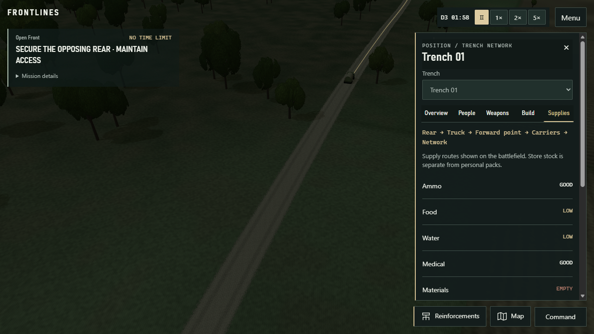
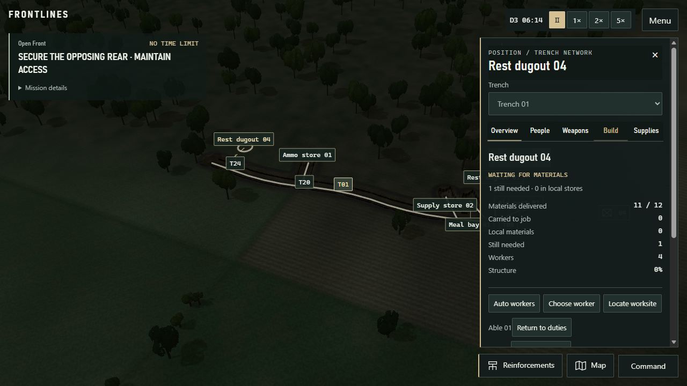

# V1 trench / weapon position / construction / supply rebuild

## Status and revision identity

- START HEAD: `4fdf7eda4563b4e8ada9112f9911cc7d33c5aa6d` (verified before edits; clean `master`).
- END HEAD — verified implementation: `553df9d9a4a8ee435f3c409208007410241e0473`.
- This report and its screenshot copies are a subsequent documentation-only commit. The implementation hash above identifies the tested source and generated HTML, not a self-referential report commit.
- Rules identity: `combat-34-individual-position-crews-world2`.
- Standalone: root `FRONTLINES.html`, SHA-256 `22afcdc2ed25087c4f912054e75e84aac55a8ef3d45a4405cc30dc7f1a3880dd`.
- Implementation and developer-controlled playthrough completed. **Independent discoverability / believability acceptance is still pending. This is not a CrazyGames-ready or polished-UX certification.**

The pass changes existing position workflows, not Operations V2, world scale, weapon categories, casualty rules, campaign objectives or AI architecture. No training, automation, paid services or website deployment was started. The existing Three.js, UI and playtest guidance informed simulation-owned geometry, a contextual inspector and screenshot-based verification.

## MG position before / after

Before: a rear support building with a 6–40 m connector, squad ownership and an implicit operator/helper.

Now: Build → Weapon position → MG position. Click excavated trench, aim the facing preview, click again. The saved anchor is the parent trench ID plus metres along its polyline and facing. Shared simulation geometry places a small post at the chosen edge and crew space inside; no new connector is created. Width-aware validation covers both narrow player trenches and the prepared 7.2 m trenches. Unexcavated or detached anchors and overlapping posts are rejected.

The post does not create a gun. Its two explicit crew IDs must include an existing mounted-MG carrier. A cross-formation assistant is allowed; unrelated formation orders remain unchanged. Both people must reach usable excavated ground, remain fit and have ammunition. The existing shot/visibility system controls automatic engagement, constrained to the mounted facing sector. BARs remain portable. Mounted heavy guns cannot fire as ordinary portable rifles.

## Mortar position before / after

Before: the generic rear-facility validator and formation-owned support workflow.

Now: a separate adjacent-combat category, 4–20 m from excavated trench, with clear open ground and a short physical connector. It renders as an open pit rather than a square roofed building. Rear aid/rest/meal/store facilities retain their own 6–40 m rear-side rules.

Click the completed pit, assign its actual equipment carrier and assistant, then Fire HE or Fire smoke and choose a target. Requests resolve the assigned operator internally. Global Support lists position readiness and opens the same inspector. Missions retain named crew IDs. Enemy crews use the same built-position/equipment/arrival checks; commander information was not broadened.

## Construction workflow

Explicit work orders store individual worker IDs. Available local workers are assigned on placement; Auto workers and Choose worker remain available in the position inspector. Two workers are initially sought for weapon posts and four for rear support. Tool carriers perform skilled work; present helpers add reduced-rate labor, not tool-free excavation.

Funded explicit work outranks ordinary patrol, rest and watch recruitment. Combat reactions, casualty care, incapacitation and physically carried deliveries retain priority. No squad must first receive a garrison order just to build one post. Main trench digging keeps its existing formation work parties and engineer queues.

The inspector derives waiting, transit, approaching, building, interruption, blocked and complete states from actual duties, delivered materials and progress. It shows local materials, delivered cost, carried-to-job materials, outstanding cost and named workers. Materials are consumed only once after arrival, not at placement.

Playthrough fixes included:

- Completed construction duties were holding workers in crew approaches; stale completed duties now release before movement.
- A late pickup could withdraw a second budget after another carrier paid the job. Paid jobs no longer withdraw again; excess already aboard returns physically to stores.
- Empty material pickups could send workers to crowd a waiting worksite. Empty job trips are released rather than treated as loaded deliveries.
- Explicit material shortages now reserve limited truck cargo space before routine top-ups, unless critical food/water/ammunition needs take precedence.

## Person-level control and trench identity

Click trenches, facilities or trucks directly. Position management combines Overview, People, Weapons, Build and Supplies. It displays connected trenches, real capacity and excavation, local people and structures. Selected and hovered networks are outlined; management labels identify T01 etc. and named facilities. Normal battle uses hover context instead of permanent labels everywhere.

Alt-click a friendly soldier or choose a person in People. PERSON SELECTED clears formation selection and hides formation commands. Move here and Watch here target reachable excavated floor; Rest, Eat / drink and Automatic duties retain their normal safety/need rules. Clicking a weapon position assigns only that person or reports a concrete rejection. Manual crew removal affects only the specified people.

Detached individual membership is explicit state, not a hidden squad assignment. Squad movement/centroid updates exclude detached people until a new formation order deliberately releases that assignment. Routine crew relief cannot silently steal an explicitly reserved gun crew.

Management labels use bounded collision placement with leader lines. Their projection follows the rendered camera every frame, with no camera-motion hide/fade trick. Data refresh and army queries run at 250 ms intervals; the projected label set is bounded to 60 trenches plus 60 facilities. Low-priority labels can be omitted at crowded full-sector scale. The existing emergency decision temporarily closes the Position inspector so it cannot cover the decision controls.

## Supply UX

Supplies answers three separate questions: stock actually here, stock inbound, and personal packs. GOOD / LOW / EMPTY expands to numbers and the threshold, rather than concealing an arbitrary rating. Construction allocation is separate from usable stock. Mortar crew and nearby-store HE/smoke counts, and MG crew/store rounds, are visible at their positions.

The optional supply view follows actual truck/carrier routes. Trucks show real cargo, state, reason, remaining route distance and Locate; there is no fabricated ETA. Last delivery is recorded only when a truck transfers cargo into forward stock. Forward stock and shipments do not become local usable stock until a carrier arrives.

The playthrough deliberately retained a road-cut failure: the new trench crossed a road, truck 367 stopped with 30 ammunition / 55 food / 55 water still aboard, and the UI reported the obstruction. The game did not refill the network invisibly.

## Save migration

The existing v3 world-2 storage key remains. Source v1/v2 keys are not deleted or overwritten by migration. The migration consumes legacy `weaponSquadId` only after normal save validation, chooses a suitable existing operator/helper deterministically, prevents duplicate assignment and removes the obsolete ownership field. If a safe crew cannot be chosen, the existing structure remains uncrewed and a load notice reports it. It never adds equipment, ammunition or people or moves their coordinates.

Old structure coordinates/geometry are preserved, not silently rebuilt into new inline posts. New positions save their anchor, facing, explicit crew/workers and personal membership. Duplicate crew/work reservations, invalid anchors/facing and side mismatches are rejected. Changed rules invalidate incompatible neural policies; the rule-based fallback remains.

Same-rules exact continuation is covered by regressions. The real operation was also saved during an unfinished material delivery and reloaded through Continue: the whole simulation state matched byte-for-byte after excluding only save-added policy metadata. MG crew `[296,269]`, mortar crew `[303,278]`, work order 471 and carried materials were unchanged. User browser profiles and saved games were not used for QA.

## Real-browser playtest

Isolated headed Edge session `v1-position-qa`, ordinary mouse/keyboard controls on the built preview. Fresh Operations → Open Front, medium 48-v-48 forces, U.S., seed 1944, Closer approach. This was a developer-controlled flow continued through normal saves during iterative fixes, **not** an independent blind test or one uninterrupted run.

No debug state restoration, spawning, simulation advance or camera teleport commands were used for this manual flow. Read-only state/projected-coordinate diagnostics corroborated visible actions. Automated regression fixtures separately use setup helpers and are not presented as manual play evidence.

| Required step | Observed result |
| --- | --- |
| 1. Draw trench | Baker selected; a 25 m extension was drawn on the battlefield. |
| 2. Assign workers | Normal trench command assigned the available work party. |
| 3. Watch digging begin | Screenshot recorded physical digging at 4%; completed by about 123 simulation seconds. |
| 4. Click completed trench | Direct terrain click opened T07 and its connection to T02. |
| 5. Place inline MG | Two clicks anchored post 397 on T07 and set facing; no connector added. |
| 6. Understand waiting | Inspector showed the 16-material requirement, local stock and named workers. |
| 7. Complete construction | Materials were carried and consumed; builders finished the post. |
| 8. Choose two people | Easy 03 (296, gun) and Baker 03 (269, assistant) were chosen individually. |
| 9. Only those occupy it | Before/after diagnostics confirmed unrelated people and all squad orders unchanged at assignment. Both crew walked to the post. |
| 10. MG engages | Gunner fired 10 actual shots at a visible enemy; carried rounds fell 60 → 50. Assistant remained separate. |
| 11. Build mortar | Pit 402 and short connector T16 were delivered and built near T03. |
| 12. Individual mortar crew | Fox 01 (303, equipment) plus Charlie 03 (278, assistant) arrived and showed READY. |
| 13. Fire player mission | HE request at elapsed 535.4; mission 407 launched at 550.4, consumed one HE round and used a dispersed impact with scheduled arrival 554.1445. |
| 14. Inspect ammunition | Crew/store rounds and 12 HE / 6 smoke carried were inspected through the position. |
| 15. Follow physical delivery | Truck 366 carried two materials at 2406.55, forward stock held them at 2656.3, people 259/286 carried one each at 3010.35, and 286's delivered unit reached the network and worksite: job 471 rose from 10 to 11 delivered by 3371.55. |
| 16. Move one person | Able 06 (263) was ordered to another trench point; only that person changed orders and physically walked there. Alt-click was also checked separately. |
| 17. Automatic duties | The person returned through the explicit Automatic duties control. |
| 18. Save | Normal paused Menu → Save, including completed weapons and the unfinished delivery. |
| 19. Reload | Browser refresh → Continue, without editing storage. |
| 20. Verify state | Exact matching simulation JSON at elapsed 3468.70, speed 0; crew, construction, anchors, inventories and material carriers retained. |

The delivery check exposed substantial real latency: the forward point was roughly 500 m from T01, and other shipments were road-blocked. The additional rest job still needed **one** material in the final saved QA state; it was not falsely called complete. Both required weapon builds completed earlier in this same flow.

## Viewport checks

Actual Edge viewport resizing was performed while the individual inspector remained open. Canvas matched the viewport and no horizontal document overflow was present. Vertical scrolling is intentional at short heights; tabs and basic person commands remain available.

| Viewport | Inspector width / height | Evidence |
| --- | --- | --- |
| 907 × 510 | 330 / 386 px | [Screenshot](evidence/v1-trench-management/v1-final-viewport-907x510.png) |
| 1216 × 684 | 370 / 542 px | [Screenshot](evidence/v1-trench-management/v1-final-viewport-1216x684.png) |
| 1280 × 720 | 370 / 578 px | [Screenshot](evidence/v1-trench-management/v1-final-viewport-1280x720.png) |
| 1920 × 1080 | 370 / 610.5 px | [Screenshot](evidence/v1-trench-management/v1-final-viewport-1920x1080.png) |

Screenshots were visually inspected, not merely generated. These are desktop embedded-size checks, not CrazyGames platform approval or mobile acceptance.

## Verification

- `npm test`: **75 files / 585 tests passed**. Includes the existing 72-campaign-hour conservation soak, complex branched engineer jobs, Operations V2, spotting/aim/casualty regressions, deterministic speed/save continuation and 22 new position-management cases.
- `npm run build`: **passed**, including TypeScript, Vite and the self-contained HTML build. Existing large-chunk warning remains; no claim that browser performance targets were met by this pass.
- `npm run test:e2e`: **23 tests passed** after updating obsolete squad-ownership/old-menu assertions and adding the emergency-drawer regression.
- `npm run test:packaging`: **5 passed**.
- `node scripts/qa-file-boot.mjs FRONTLINES.html v1-position-shipping-offline isolated`: **passed**. A copied standalone HTML booted with networking disabled, created terrain/navigation workers, accepted an actual movement order and continued an exact paused save. Both 1280 × 720 and 1920 × 1080 refresh sizing checks passed; no page/console errors or HTTP dependencies.
- Offline state hashes before/after load both `329eba1a3a3845333509cf9edbc418f4b2cba791efa356b953c15fa8787b9e87`.
- `git diff --check`: passed before the implementation commit.

Local detailed evidence remains under `output/playwright/`, including the full numbered manual screenshots, `v1-position-shipping-offline-1790306461318/result.json`, and its isolated HTML. Representative screenshots are copied into this report's tracked evidence directory so repository readers can see them.

Failures were preserved, not overwritten as successes: `v1-e2e-initial-failures/` contains the initial obsolete menu/ownership assertions and a dev reload during editing; `v1-emergency-test-first-attempt/` contains the test that tried to click a command through the emergency drawer before resolving it. The final test resolves/closes that drawer through ordinary controls. Manual locator failures remain in the local CLI logs; they are not counted as successful player actions.

## Remaining problems and acceptance boundary

1. **Blind tester pending.** Give someone who has not read this implementation only: “Build a trench, put an MG in it, crew it, then build and fire a mortar.” Record whether they discover the controls. Developer knowledge and green tests cannot satisfy this gate.
2. **Long logistics trips remain slow.** The 500 m foot leg, small carrier loads, needs breaks and road cuts were conspicuous in real play. The inspector now explains them; it does not make them pleasant automatically. Forward-point siting and pacing need player review before V1 acceptance. No new transport or bridge system was added.
3. **The inspector is functional, not a finished art pass.** Existing prototype materials/animation remain. Management labels can still compete with formation symbols, and short windows need scrolling. Collision placement only resolves management labels against one another.
4. **Some legacy surfaces remain.** Defense readiness/emergency decisions and global Support are secondary entry points. They were not removed wholesale. Closing their drawer may be necessary before opening the Command menu. Construction selection is unified in Position, but main digging remains a formation action.
5. **Historical excess material is not teleported away.** The late-material fix prevents new double withdrawals and returns newly surplus cargo physically. A pre-fix save can still contain surplus stock left at an old non-store facility; this pass does not invent a recovery transfer or erase it.
6. **Crew state labels are bounded by existing simulation state.** No new damage model was added for positions; readiness cannot honestly expose damage that the simulation does not track. Low ammunition is numerical; final firing authority still uses the actual gunner and rounds.
7. **No new large-army performance certification.** Queries/labels are bounded and the existing 300-person finite-state regression passes, but fresh 300/1,000-person p95 browser benchmarks were not run. Do not infer them from the 48-v-48 player flow.

The existing-system commands are now implemented and exercised. Whether their pacing, appearance and discoverability are good enough remains a separate user/tester decision.
