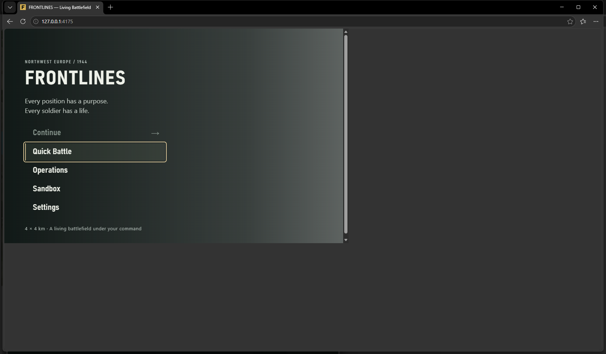
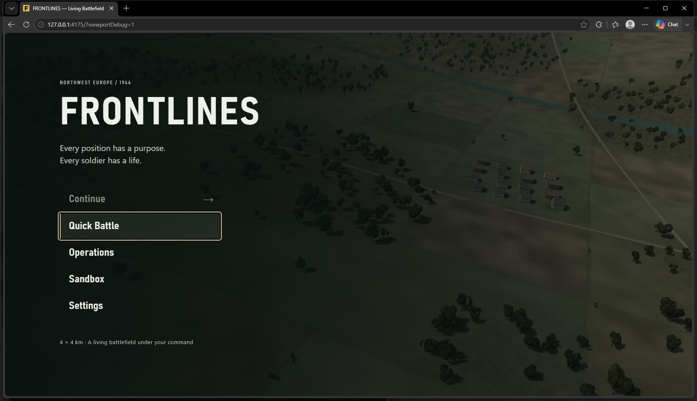
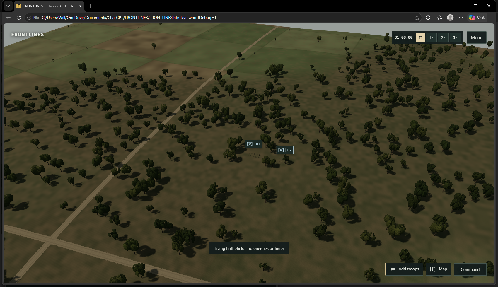

# V1 viewport blocker — investigation and repair

## Finding: reproduced before changing the game

Starting revision: `a744ef365c2aa3b6706d641e68c6907f6b0ebd70`, clean working tree. No player window/profile was attached to, resized, reloaded, cleared or used as a test destination.

The reported **small game / large gray area / resize fixes it until refresh** failure is reproducible through the previous test-tool workflow, even when every CSS layer correctly fills `window.innerWidth` and `innerHeight`.

In a newly created, disposable Edge process, the previous sequence was reproduced: create a 960 × 600 emulated context, try a zero-sized viewport as a native reset, resize the actual window, then reload. Full native-window capture reproduced the large unused gray area outside the document.

| Stage | Edge outer window | Document, app, canvas and menu |
| --- | --- | --- |
| Pinned test viewport | 1700 × 1000 | 960 × 600 |
| After native window resize | 1690 × 990 | 1666 × 898 |
| Refresh, without resizing again | 1690 × 990 | **960 × 600** |
| Clear CDP metrics, then refresh | 1690 × 990 | **960 × 600** |

Source evidence: `output/playwright/viewport-before-1790351671843/result.json` and its full-window PNG. This is a controlled reproduction of the screenshot's failure mode, not proof of the current state of an untouched player tab. A page-only screenshot or an assertion comparing canvas against the emulated `innerWidth` would falsely accept this broken handoff.



## Changes

- **Browser isolation fixes the reproduced cause.** `run-browser-probe.mjs` no longer connects to a named reusable CLI session. Its first argument is only an evidence label. Every invocation launches its own temporary browser, clears its metrics during cleanup, and closes it in `finally`, including failures. Failed boolean checks produce a nonzero exit code.
- The old CDP-release and automated player-profile-transfer scripts are retired with explicit errors. Previous profiles and saves remain intact. README no longer recommends handing off an automation-controlled window for normal play. Historical callback probes remain in the repository, but must run through the disposable runner; some target obsolete UI.
- **`#app` is the render-size authority.** `HostViewport` observes the host, not the canvas. Canvas/UI fill that host; Three.js backing size and camera aspect follow its measured CSS bounds. The host inherits its containing document's height instead of independently forcing `100dvh`. No monitor-size guess or physical-screen-sized CSS was added.
- Resize requests are coalesced; unchanged bounds do not reallocate the renderer. Fractional dimensions are retained. A collapsed/hidden host does not install a bogus 1 × 1 projection. Fullscreen, page restoration, visual viewport and resolution changes trigger remeasurement.
- **DPR-only robustness:** an added regression found Chromium can omit resize/media-query events when just its pixel density changes. The existing render loop now compares one DPR number per frame; it performs a layout read only if that number changes. CSS bounds never get multiplied by DPR. Existing quality caps remain in effect (Balanced caps renderer DPR at 1.25).
- The main menu takes its rectangle from the measured host. Menu, operational map and drawing overlays are descendants of `#app`, so host fullscreen retains them.
- Simulation, save schema/rules, people, inventories and player orders are unchanged.

The UI/Three.js guidance kept this a presentation/lifecycle repair. The playtest guidance required real controls and full-window screenshot inspection rather than accepting dimension checks alone.

## Read-only development diagnostic

In Vite development, or with explicit `?viewportDebug=1` on a built/offline QA URL:

```js
window.__FRONTLINES_VIEWPORT__()
```

Reports inner and outer window dimensions, visual viewport size/scale/offset, document/body/app/canvas/UI/menu/overlay bounds, canvas backing resolution, device and renderer pixel ratios, camera aspect, fullscreen element, iframe state and horizontal overflow. It has no state-changing commands and no on-screen overlay. Production pages without the explicit query parameter do not install the diagnostic.

A webpage cannot reliably infer the browser's actual content area from `outerWidth`, screen pixels, or a screenshot; browser chrome, zoom and iframes are legitimate differences. The diagnostic exposes layers without treating a small iframe as a broken monitor-size viewport.

## Verification

### Production, standalone and a real iframe

`node scripts/qa-viewport.mjs` uses owned disposable Edge contexts. `tests/fixtures/viewport-host.html` is served from a separate local origin and embeds the actual production page, not a fake canvas. Visible parent controls change the iframe's container without reloading the game.

- **58 successful samples:** top-level production and offline refresh/dynamic resize, real iframe menu/gameplay resize, hide/reveal, fullscreen/exit, DPR 1 / 1.25 / 1.5 / 2, and live DPR-only changes.
- Sizes include **907 × 510, 1216 × 684, 821 × 462, 1280 × 720, 1920 × 1080**, and **973 × 557 / 1043 × 619** intermediate sizes.
- Every sample verifies app/canvas/UI/menu bounds against the available CSS viewport (small subpixel tolerance), backing resolution, camera aspect and no horizontal document/menu overflow.
- **17 actual mouse movement orders** checked ground picking after resizes/fullscreen; projected troop labels were checked against DOM positions. Read-only state/projection diagnostics assisted targeting, but orders used real mouse clicks.
- Embedded fullscreen also exercised the pause menu and operational map. No page errors. The fixture's blue-gray *outer website* is deliberately outside the gold game container; the game fills all of the interior.
- Final matrix evidence: `output/playwright/viewport-1790352563923/result.json`.

### Native Edge and actual browser zoom

`node scripts/qa-viewport-native.mjs` creates a fresh temporary Edge profile with `viewport: null`, closes it in `finally`, and never reads an existing profile. A tiny test-only extension sets actual `chrome.tabs.setZoom`, verified through `getZoom` and changed CSS dimensions/DPR. This is not CSS zoom, pinch scaling, or pretending browser zoom through device emulation. Zoom resets before cleanup; the extension is never installed into the player's Edge.

Native tests cover two actual window sizes, repeated normal/cache-disabled refreshes, **80% / 100% / 125% / 150%** zoom and refresh at each, native browser fullscreen, host-element fullscreen, exact exit dimensions, and both hosted and standalone builds. Windows captures include the entire browser window, not just the emulated page surface.

**42 native samples passed**, including full-window gameplay captures. Final native evidence: `output/playwright/viewport-native-1790352862395/result.json`. The final capture pass additionally waits for camera easing and coarse terrain generation to settle. All committed captures were inspected; the canvas/menu/game fill the browser's real content rectangle, including after refresh. Vertical scrolling at enlarged zoom is intentional; there is no horizontal menu overflow or external unused game region.





Additional captures: [150% real browser zoom](evidence/v1-viewport/edge-zoom-150.png), [1216 × 684 embedded menu](evidence/v1-viewport/iframe-menu-1216.png), [821 × 462 embedded gameplay](evidence/v1-viewport/iframe-gameplay-821.png). Committed measurements: [before reproduction](evidence/v1-viewport/before.json), [production/offline/iframe matrix](evidence/v1-viewport/matrix.json), [native Edge samples](evidence/v1-viewport/native.json).

### Build and regressions

- `npx vitest run --maxWorkers=1`: **77 files / 609 tests passed**, 169.71 seconds. Includes seven new viewport authority checks, existing camera projection/HUD checks, save/continuation and the existing 72-campaign-hour conservation soak. Log: `output/playwright/viewport-unit-final.log`.
- `npx playwright test --workers=1`: **23 passed** on final game sources (1.6 minutes). Existing menus, commands, mortar UI, save/load, reserves and eight layout regressions remain green. Log: `output/playwright/viewport-e2e-final.log`.
- Production build and regenerated offline HTML: **passed**. Existing large-bundle warning remains. Final hosted bundle: `main-CAn20EUZ.js`.
- Packaging checks: **5 passed**.
- Copied single-file offline Edge launch: **passed**. Actual movement, both embedded workers, exact paused save/load, refresh sizing and no HTTP dependencies/errors. Evidence: `output/playwright/viewport-final-offline-1790352873428/result.json`; both state hashes are `e7cbabf4c996975215a3cfeac7ea96022d0a8e2d68021bd519a4feb930ab0a22`.
- Final offline HTML SHA-256: `1456561b940fcae7cc8b34f6b3992b7c1bb4e76b07e8d781965a8149b3ad8077`.
- Disposable legacy runner's fixed-viewport smoke check passed; the old player-session attachment path is no longer called.
- `git diff --check`: **passed**.

## Failed attempts retained

- The first new picking check sampled a camera that was still easing into focus. The revised fixture waits for settled camera position/zoom; no game targeting tolerance was loosened.
- Three native shortcut attempts failed: an unsupported SendKeys token, then shortcuts that did not change the actual tab zoom. These are not counted as zoom evidence. The successful extension route verifies the actual zoom factor and resulting dimensions.
- The first added DPR-only test timed out with a stale renderer ratio despite unchanged CSS bounds. This prompted the per-frame numeric DPR check and its regression.
- A historical fixed-viewport status callback was tried in a correctly native-sized disposable context; its fixed-fixture assumptions returned false. The proper fixed-size callback subsequently passed. Its result remains preserved.
- Earlier successful and failed runs are retained under `output/playwright/viewport-*`; nothing was relabeled or erased.

## Handoff boundary

Use an ordinary Edge tab for the production URL or open `FRONTLINES.html` directly. **An already contaminated automation-owned tab must not be reused as a player handoff.** Reloading that old tab can reapply its external override; game CSS cannot and should not override the browser's assigned viewport. Preserve that profile's saves/unsaved session; moving saves to another profile requires an explicit, reviewed transfer rather than silently overwriting storage.

This pass does not certify every OS/multi-monitor combination or live CrazyGames SDK/container integration. It verifies this PC's native Edge behavior and genuine local iframe resizing, and does not publish anything to CrazyGames. Player profiles, original saves and previous evidence are untouched.
